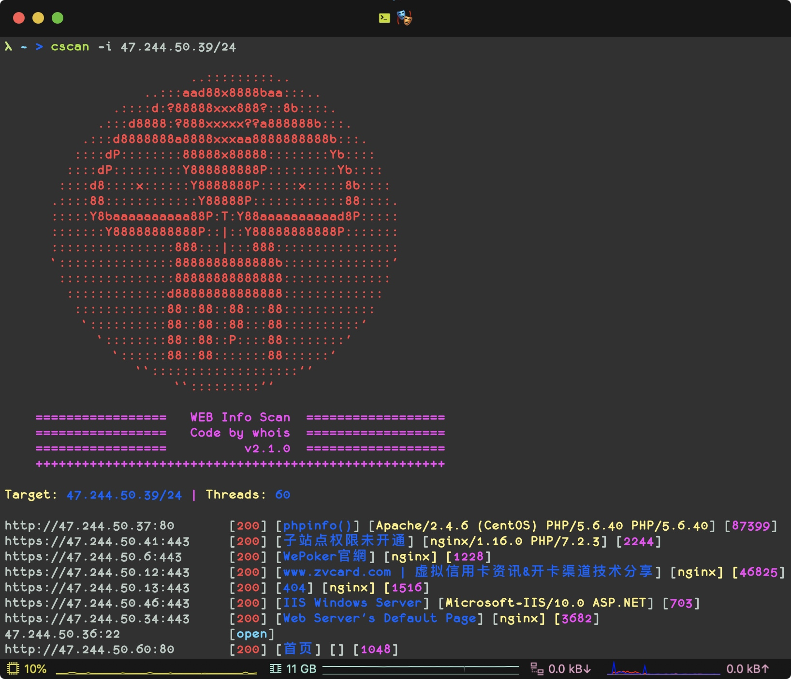
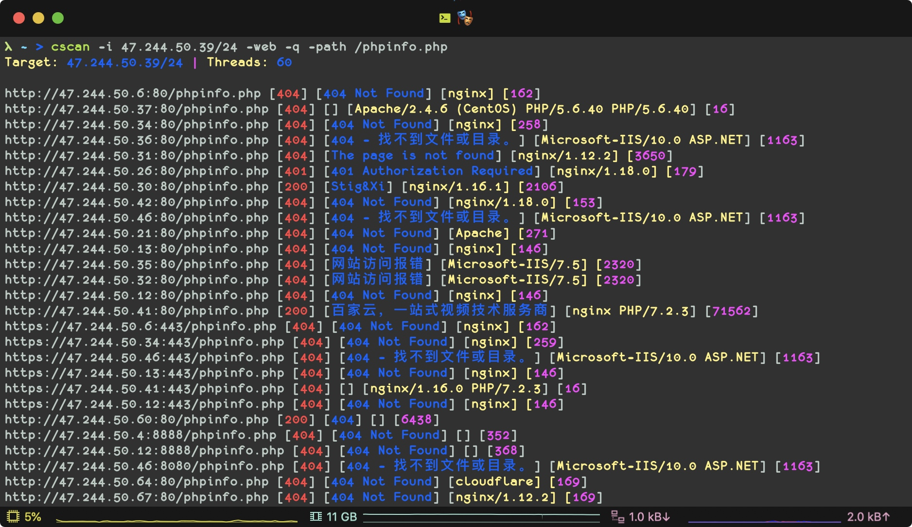
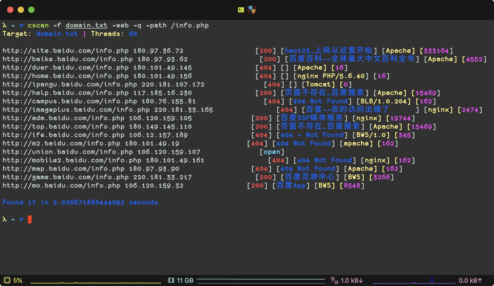

# 🍺 Cscan   [](http://www.python.org/download/) 

🔧 一款C段扫描工具，支持python3.7以上

- ~~V1版本已废弃~~
- V2版本使用协程重构

> 线程过大会导致丢包

## 1. Install
```
git clone https://github.com/j3ers3/Cscan
pip3 install -r requirement.txt
```

## 2. 配置端口（可选）
- web端口： `Ports_web = [80, 8080]`
- 非web端口：`Ports_other = [21, 22, 3306]`


## 3. Usage
- 普通扫描

```python
python3 cscanV2.py -i 192.168.0.1/24
```


- 只扫描web端口，并使用安静模式

```python
python3 cscanV2.py -i 192.168.0.1/24 -t 100 -web -q
```

- 扫描web端口，并指定路径来发现敏感信息

```python
python3 cscanV2.py -i 192.168.0.1/24 -web -path /phpinfo.php 
python3 cscanV2.py -f domain.txt -web -path /phpinfo.php 
```






## 4. ChangeLog
#### 2.2.0
- 添加`-key`匹配关键内容
- 添加`-ip` 输出目标IP
- 添加`-port` 指定自定义端口
- 优化了文件模式输出

#### 2.1.1
- 修复了一些bug

#### v2.1.0 
- 增加`-path`指定路径扫描
- 增加`-web`只扫描web端口
- 增加`-q`安静模式
- 做了一些优化输出
- 修复了http头信息错误
