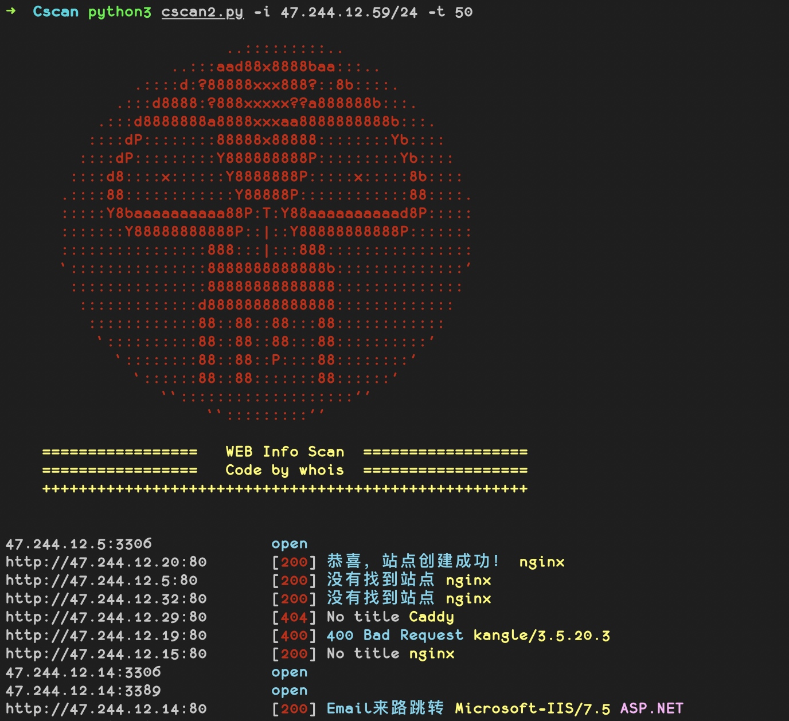
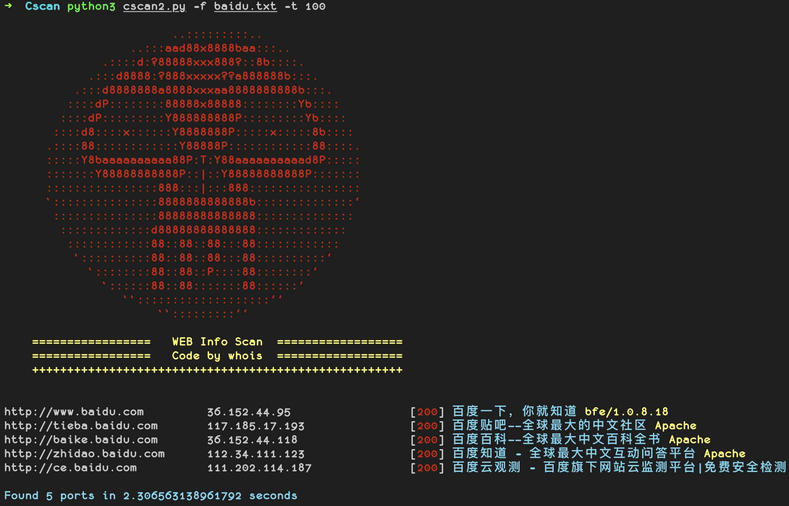

# 🍺 Cscan   [](http://www.python.org/download/) 

🔧 一款C段扫描工具，支持python3

- ~~V1版本已废弃~~
- V2版本使用协程重构

> 线程过大会导致丢包

## Install
```
git clone https://github.com/j3ers3/Cscan
pip3 install -r requirement.txt

配置端口
- web端口： Ports_web = [80, 8080]
- 非web端口：Ports_other = [21, 22, 3306]
```

## Usage
- C段扫描

```
python3 cscanV2.py -i 192.168.0.1/24 -t 100
```



- 域名或ip文件扫描

```
python3 cscanV2.py -f domain.txt -t 100
```


## ToDo
- [ ] 优化输出
- [ ] 增加IP反查
